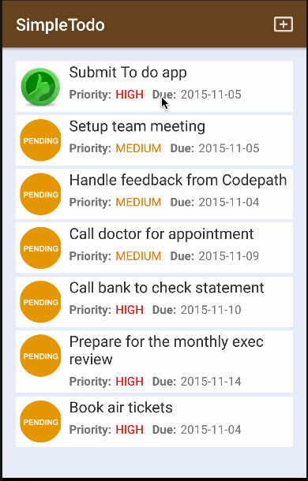

# SimpleTodo
A sample TodoList project for CodePath

This is an Android demo application for displaying the latest box office movies using the [RottenTomatoes API](http://www.rottentomatoes.com/). See the [RottenTomatoes Networking Tutorial](http://guides.thecodepath.com/android/RottenTomatoes-Networking-Tutorial) on our cliffnotes for a step-by-step tutorial.

## User Stories

The following **required** functionality is completed:

* [x] User can **successfully add and remove items** from the todo list
* [x] User can **tap a todo item in the list and bring up an edit screen for the todo item** and then have any changes to the text reflected in the todo list.
* [x] User can **persist todo items** and retrieve them properly on app restart

The following **optional** features are implemented:

* [x] Persist the todo items [into SQLite](http://guides.codepath.com/android/Persisting-Data-to-the-Device#sqlite) instead of a text file
* [x] Improve style of the todo items in the list [using a custom adapter](http://guides.codepath.com/android/Using-an-ArrayAdapter-with-ListView)
* [x] Add support for completion due dates for todo items (and display within listview item)
* [ ] Use a [DialogFragment](http://guides.codepath.com/android/Using-DialogFragment) instead of new Activity for editing items
* [x] Add support for selecting the priority of each todo item (and display in listview item)
* [x] Tweak the style improving the UI / UX, play with colors, images or backgrounds

The following **additional** features are implemented:

* [x] Added a splash screen
* [x] Indicated to-do item status using an icon
* [x] Added activity transition animations
* [x] Added an view screen with a delete button
* [x] Added tool-bar buttons for the actions
* [x] Added card-like UX for the list

Walkthrough of all user stories:

GIF created with [LiceCap](http://www.cockos.com/licecap/).
